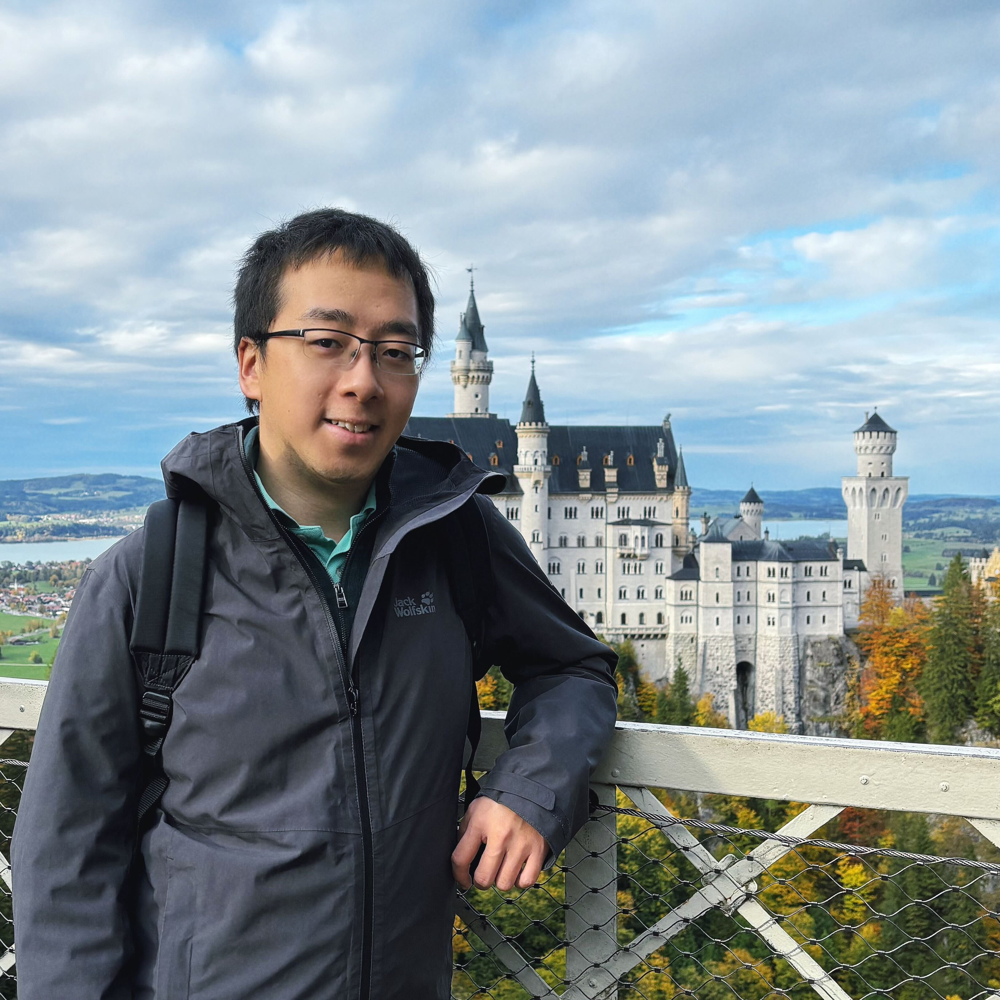

I am a Ph.D. candidate at
the [Autonomous Learning Robots](https://alr.iar.kit.edu/) (ALR) Lab of
the [Karlsruhe Institute of Technology](https://www.kit.edu/english/) (KIT),
under
the supervision
of [Prof. Gerhard Neumann](https://scholar.google.de/citations?user=GL360kMAAAAJ&hl=en).
In addition, I collaborate closely
with [T.T. Prof. Rudolf Lioutikov](https://rudolf.intuitive-robots.net/).
 

My research primarily concentrates on advancing the learning and representation
of robotic movement trajectories, with a particular emphasis on their
application in tasks involving robot imitation and reinforcement learning. I
hold the conviction that robots possess the potential to learn and emulate human
behavior, enabling them to observe their surroundings and execute movements in
an intuitive fashion. This intuition encompasses movements that are both smooth
and consistent. In pursuit of these objectives, I am committed to enhancing the
**capacity of models**, their **learning efficiency**, and their ability to
provide
**explanations**, all through the adoption of state-of-the-art algorithms and
tools.
Along with my research, I also serve as a teaching assistant at KIT, including
Cognitive Systems (SS20, SS21), Machine Learning (WS21/22, SS23), and partially
in Deep Reinforcement Learning (WS21/22).
I also lead and supervise several Bachelor's and Master's research projects,
seminars and theses.

[//]: # ( )

I was born and raised in Beijing, China and obtained my Bachelor's degree in
Mechanical Engineering at
the [University of Science and Technology of China](https://en.wikipedia.org/wiki/University_of_Science_and_Technology_of_China).
Subsequently, I moved to Germany and obtained my Master's degree in
Computer-Aided
Mechanical Engineering at
the [RWTH Aachen University](https://en.wikipedia.org/wiki/RWTH_Aachen_University).
During this period, my interests shifted towards Robotics and Computer Science.
leading me to
the [Max Planck Institute for Intelligent Systems](https://is.mpg.de/)
(MPIIS) for my Master's thesis, where I met my thesis
supervisor [Prof. Jan Peters](https://www.ias.informatik.tu-darmstadt.de/Team/JanPeters)
and my current Ph.D.
advisor [Prof. Gerhard Neumann](https://scholar.google.de/citations?user=GL360kMAAAAJ&hl=en).

# News

Jan 2024, one paper got accepted at ICLR 2024, I am going to present it in
Vienna, Austria.

Oct 2023, I presented my RAL paper at IROS 2023 in Detroit, US.

Aug 2023, I joined
the [IWIAS](https://www.ias.informatik.tu-darmstadt.de/Workshop/IWIALS) in
Kleinwalsertal, Austria.
and met 100+ European researchers in robot learning.

Jan 2023, one paper got accepted by IEEE RAL.

# Publications

[//]: # (TCE)

Open the Black Box: Step-based Policy Updates for Temporally-Correlated Episodic
Reinforcement
Learning. [arxiv](https://arxiv.org/abs/2401.11437)   |   [OpenReview](https://openreview.net/forum?id=mnipav175N)  |  [GitHub](https://github.com/BruceGeLi/TCE_RL)

**Ge Li**, Hongyi Zhou, Dominik Roth, Serge Thilges, Fabian Otto, Rudolf
Lioutikov, Gerhard Neumann,
in International Conference on Learning Representations (ICLR), 2024

We propose a novel RL framework that integrates step-based information into the
policy updates of Episodic RL, while preserving the broad exploration scope,
movement correlation modeling and trajectory smoothness.

[//]: # (MP3)

MP3: Movement Primitive-Based (Re-)Planning Policies, Hongyi Zhou, Fabian Otto, Onur Celik, Ge Li, Rudolf Lioutikov, Gerhard Neumann
, in CoRL 2023 Workshop on Learning Effective Abstractions for Planning (LEAP)
Primitives. [arxiv](https://arxiv.org/pdf/2306.12729.pdf)   |  [Website](https://intuitive-robots.github.io/mp3_website/)

[//]: # (ProDMP)

ProDMPs: A Unified Perspective on Dynamic and Probabilistic Movement
Primitives. [Paper](https://ieeexplore.ieee.org/document/10050558)   |  [Poster](https://drive.google.com/file/d/1s3kOqdEiMePO4eefcoBV6mDssjtks8L1/view?usp=drive_link)  |  [GitHub](https://github.com/ALRhub/ProDMP_RAL)   |  [YouTube](https://www.youtube.com/watch?v=PAM0NusL2Do&feature=youtu.be)

**Ge Li**, Zeqi Jin, Michael Volpp, Fabian Otto, Rudolf Lioutikov and Gerhard
Neumann,
in IEEE Robotics and Automation Letters (RAL), 2023.

We unified the Dynamic Movement Primitives and the Probabilistic Movement
Primitives into one model, and achieve smooth trajectory generation, goal-attractor
convergence, correlation analysis, non-linear conditioning, and online
re-planing in one framework.

[//]: # ()

[//]: # ()

